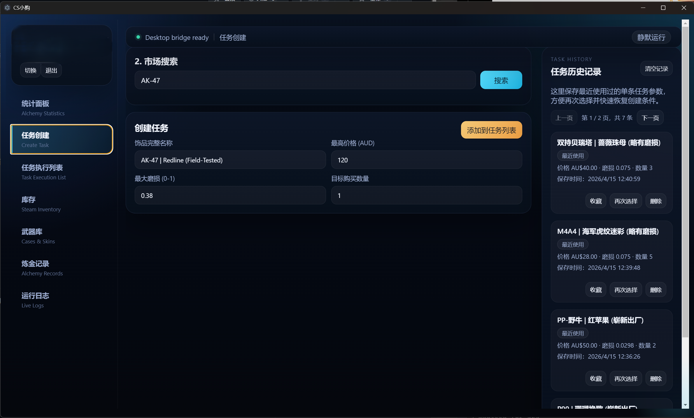
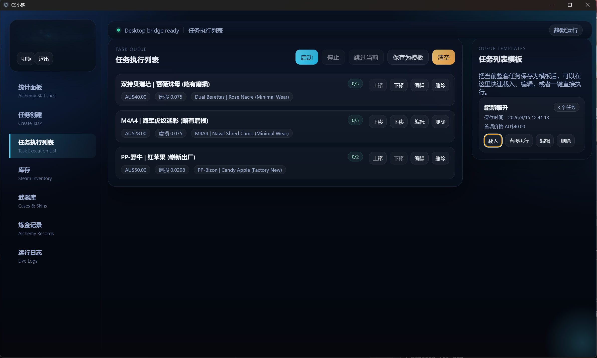
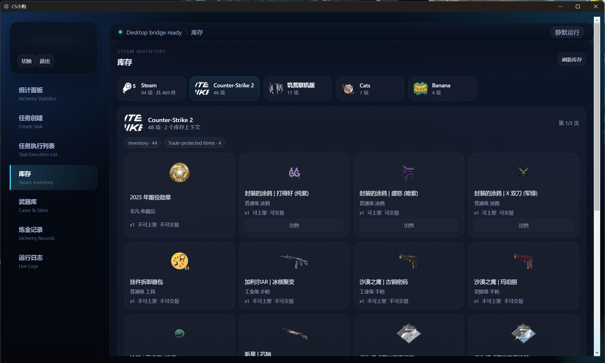
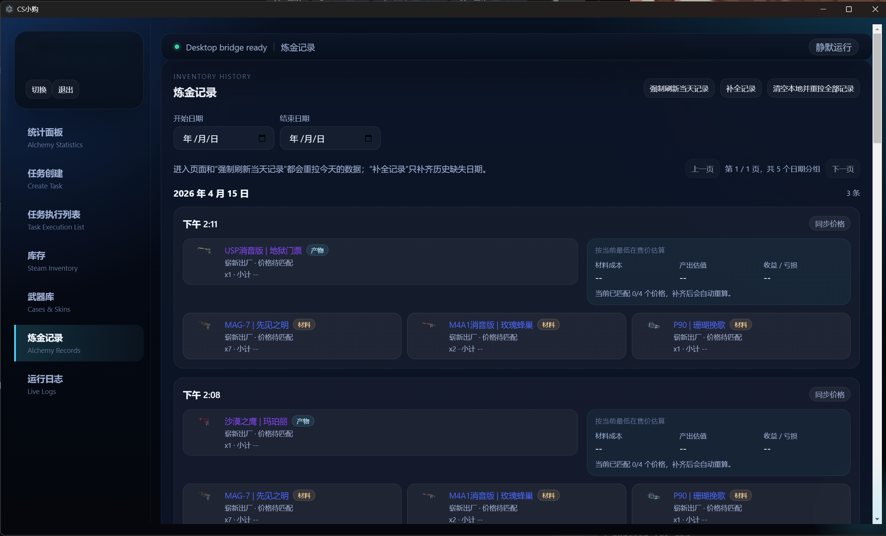
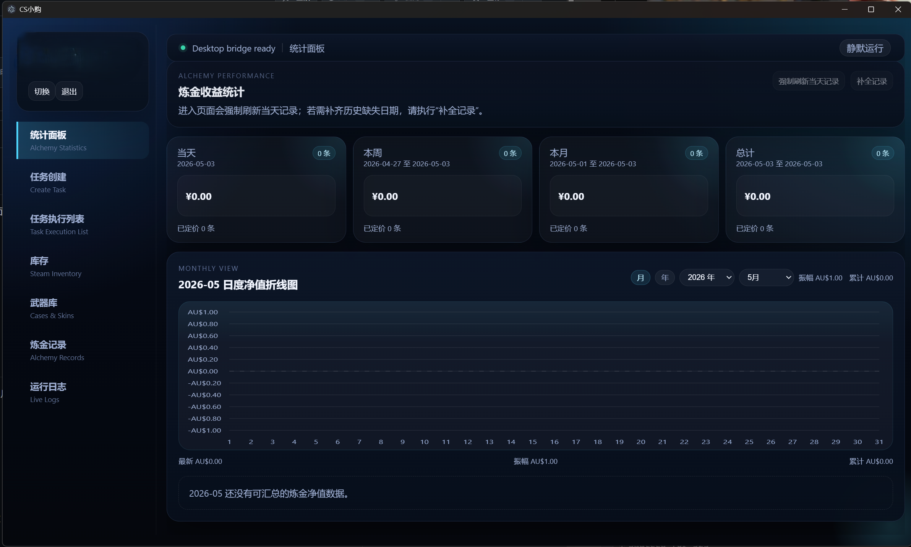
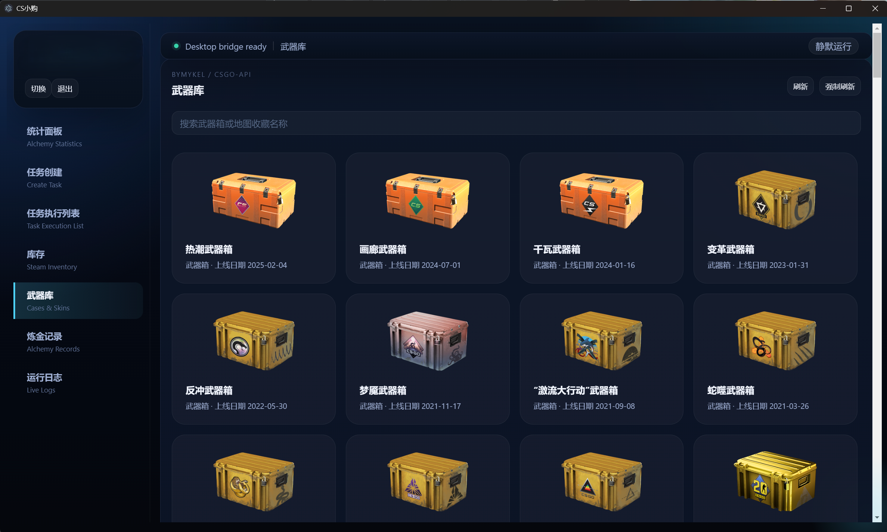
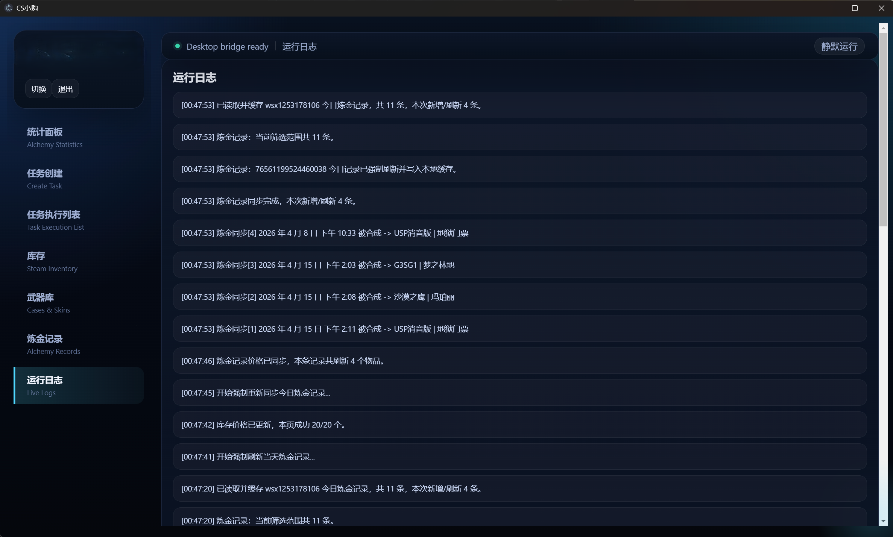
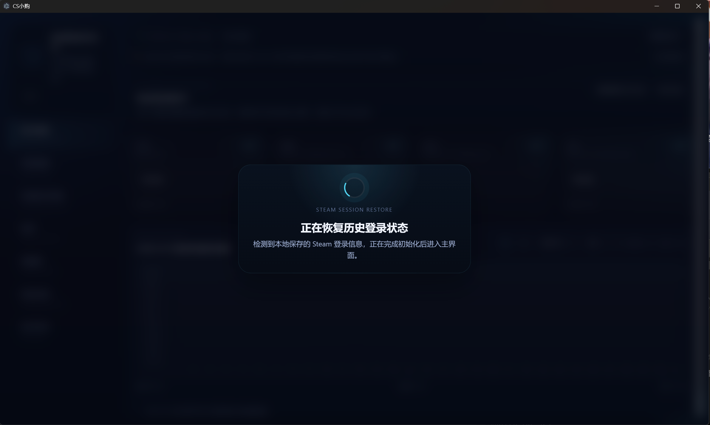

# Steam CS2 Auto Buy（CS小购）

面向 `CS2 / Steam 社区市场` 的桌面自动化工具。支持市场搜索、条件自动购买、库存与炼金记录管理。

源码开发仓库：[ToxicantX/steam-auto-bot](https://github.com/ToxicantX/steam-auto-bot)

## 主要功能

### 市场搜索与自动购买

按物品名称搜索 Steam 市场，设置最高价格和磨损 Float 限制，支持多任务顺序执行。

### 库存管理

查看当前 Steam 账号的 CS2 饰品库存，支持按市场价格估算总价值。

### 炼金记录

读取 Steam 炼金（Trade Up）历史记录，本地缓存并同步市场价格，估算收益。

### 统计面板

任务执行统计、购买成功率、消费总额等数据概览。

### 武器库

CS2 武器皮肤参考库，浏览饰品的外观、品质与稀有度信息。

### 运行日志

实时查看任务运行日志，追踪每一步操作的执行状态。

## 登录与会话保持

支持 Steam 网页扫码登录，登录状态持久化，重启后自动恢复会话。

## 下载安装

前往本仓库 [Releases](https://github.com/ToxicantX/steam-cs2-auto-buy/releases) 页面下载最新版本：

- **CS.Setup.x.x.x.exe** — Windows 安装版
- **CS.x.x.x.exe** — Windows 便携版（免安装）

## 系统要求

- Windows 10 / 11
- 无需安装 Node.js（安装包已包含运行环境）

## 使用说明

1. 启动程序，通过 Steam 网页扫码登录
2. 搜索目标饰品，设置价格和磨损条件
3. 加入任务队列并执行
4. 在任务历史、库存或炼金记录中查看结果

## 风险提示

- 本项目涉及 Steam 市场自动化操作，请自行评估账号与平台规则风险
- 建议先使用低价值饰品和小批量任务验证流程
- 如 Steam 页面结构或接口行为变化，部分功能可能需要调整
